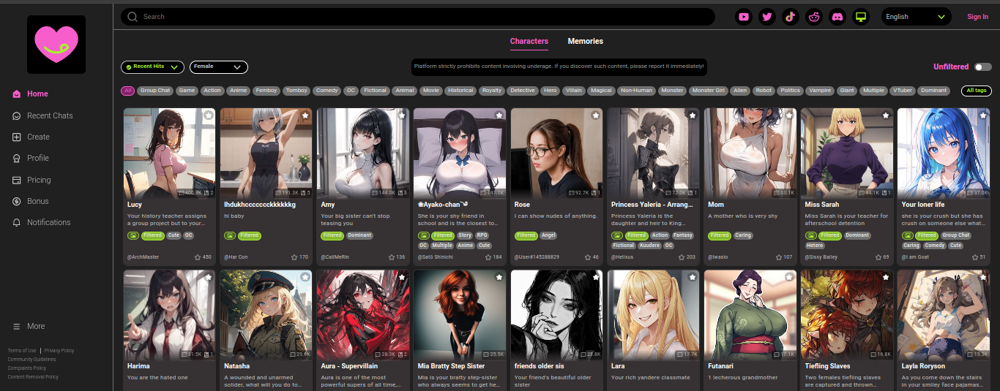
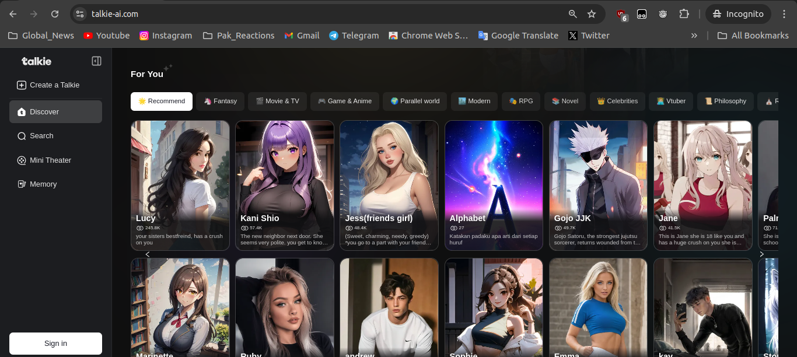
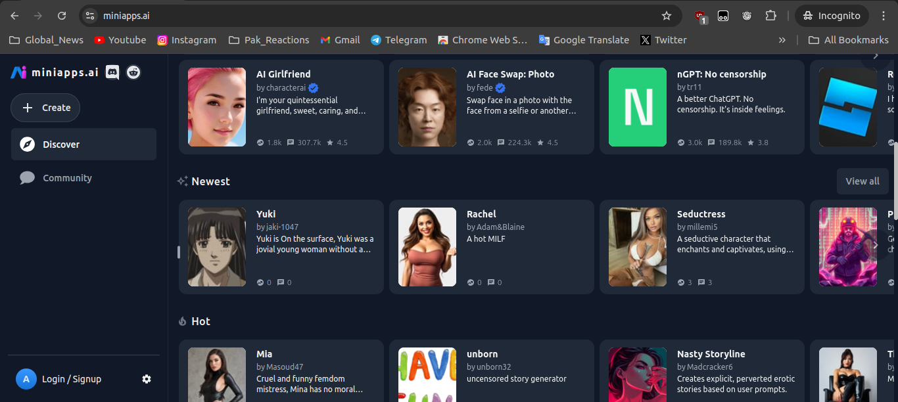

# AI Character Chat Platforms

This repository lists various AI platforms where you can chat with lifelike AI characters. Explore and engage with personalized AI companions from these websites.

## 📜 AI Character Chat Websites

1. **[CrushOn AI](https://crushon.ai)** - No Filter NSFW Character AI Chat.  
   

2. **[GPT Girlfriend](https://www.gptgirlfriend.online/tag/milf)** - Create and chat with a virtual AI girlfriend.  
   

3. **[Dopple AI](https://beta.dopple.ai)** - Interact with a variety of AI characters from different fictional worlds.  
   

4. **[Moemate AI](https://www.moemate.io)** - AI characters for lifelike and fictional roleplay from anime, games, and more.  
   

5. **[AI Cupid](https://www.aicupid.org)** - Chat with AI partners tailored to your preferences.  
   

6. **[Talkie AI](https://www.talkie-ai.com)** - Free AI character chat platform.  
   

7. **[MiniApps AI](https://miniapps.ai)** - Various AI mini-apps for interactive chats.  
   

## 📸 Website Screenshots

Below are the screenshots of the main pages of these websites:

---

Feel free to explore these AI character platforms and engage in fun and interactive conversations.

## 💻 Repository Info

This repository is updated frequently with new AI character chat websites. Contributions are welcome!
